import Video from '../../../components/Video.astro';

# Me, Me and Me


I've been wanting to learn Unity's Data-Oriented Technology Stack (DOTS) for a while now. Sadly, the documentation is still a bit lacking and the examples are all over the place. And I'm not even mentioning the fact that DOD is a whole new way of thinking about programming coming from an OOP background.

## **The Training Samples**

A month ago, I stumbled upon Unity's [DOTS training samples](https://www.notion.so/clement-landais/%5Bhttps://%5D(%3Chttps://github.com/Unity-Technologies/DOTS-training-samples%3E)). This is pretty awesome since I'm a "learn by doing" kind of guy. Exactly what I was looking for. What is it? It's a series of small projects / simulations implemented in a classic way and the goal is to reimplement them using DOTS.

The first project is called "Ant Pheromones". Quick pitch from the Readme:

> - Ants bring food from the source (green spot) to the destination (red spot).
> - Each ant spawns at the center point with a random heading.
> - Ants bounce off of walls at the inverse angle.
> - Ants will steer towards the food source (green dot) if they have line of sight.
> - Ants leave pheromone in the spots they walk over.
> - Ant steering is affected by pheromones, goal location (food or nest), obstacle avoidance and obstacle "bounce".
> - Pheromone at a spot decays over time.
> - Ant steering is also slightly randomized, so ants don’t walk in straight lines.
> - The gaps in the ring walls randomly vary in size and placement.
> - Keyboard controls allow the user to slow down, speed up, and reset the simulation.
> - The amount of pheromone an ant drops depends on the speed of the ant, and the speed depends on steering.

## The *Click*

Mission accomplished! It made DOTS click in my head. I understood the basics of how to implement a DOTS project. I was able to reimplement the project in a few days (plus some more because I tend to be quite self-demanding). I was quite impressed with the results. Without really knowing what I was doing, I was able to make a project that was running at 60fps with 100k ants on screen. I've found that the DOTS way of thinking is quite refreshing and that it encourages some good practices (separation of concerns, data-oriented design, etc.).


<Video src={frontmatter.baseVideoUrl + 'mesmerizants.mp4'} />

## The *What Now ?*

I started looking for features required to make actual full games and if they were implemented in DOTS and then stumbled upon a post on Unity's forums by Door 407, *Diplomacy Is Not An Option’*s developers. I was shocked that if you want actual skinned and animated characters without using GameObjects, you'd have to roll your own solution.

# Latios Framework


There is this *guy* you'll see a lot if you hang around Unity's DOTS forums. **Dreaming I'm Latios**. He's been working on a framework that aims to make DOTS development easier. It's called https://github.com/Dreaming381/Latios-Framework. It's still in development but it's already quite impressive!

Latios has a good number of modules and some interesting addons. It does not forces you to use everything but manages to do, as an open source project, what you would find in paid assets:
- GPU Skinning
- Audio (I always forget about audio)
- Scene Management (haven't used it yet)
- Explicit System Ordering (!!!)
- System hierarchy (Root, Super, and Sub systems)
- Fast Physics queries
- VFX Baking
- A custom transform system that just makes sense (QVVS)
- And more!

## Let’s Make a Game!

Like I said, I'm more of a "learn by doing" kind of guy. So I'll be making a game using Latios Framework. I'll be documenting the process here. I may say complete inaccuracies, so please take everything with a grain of salt. I'm still learning.

## The Game

What kind of game could make a great use of DOTS (and Latios) ? A game genre that I'm familiar with... A *Vampire Survivors-like*, obviously!

This genre makes sense as a DOTS use case because it often involves having a ton of ennemies, weapons and particles on screen.

## The Plan

## The Plan

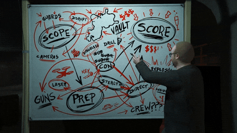

I had no plan when starting this project except for the fact that I wanted to make a *real* game with DOTS/Latios, not just a simulation.

I started by gathering CC0 assets, looking for something with a consistent style and enough content to cover most of a game’s needs.

It took me way more time than I expected. Maybe because I *absolutely* wanted to bring my usual tools with me which VContainer, Vital Router, R3 and UniTask. Sadly, VContainer's API for DOTS is pretty restrictive : it can't only register systems from existing Worlds or create new Worlds and register systems in them and I didn't manage to get ISystem injection working.

Why all the pain? Because I tend to find ECS World / GameObject world *communication* pretty *dirty*. So, yeah, I absolutely wanted to keep my usual tools with me, especially Vital Router (which works best with VContainer) to handle, mostly, the  ECS → UI communication.

I needed to figure out how to *plug* VContainer and Co into Latios / DOTS. I already had done some experiments with *pure* DOTS and Netcode for Entities: it worked but it was a pain to differentiate between client and server worlds.

If you are curious about VContainer, I’ve written two articles about it. 

[Unity Game Architecture Part 1](https://dev.to/clandais/unity-game-architecture-part-1-4a9j)

[Unity Game Architecture Part 2](https://dev.to/clandais/unity-game-architecture-part-2-335n)

# How it started - Step By Step

*I’ll recreate below what was my first milestone like (without the detours).*

## Goals

My first milestone was :

1. To have the Main Menu
2. Pressing “play” loads the Play Scene with a Latios world, a system and an entity doing something.
3. A managed System that sends data to the UI
4. A pause menu that actually pauses and un-pauses the simulation
5. Pressing “Quit” just brute-shutdown the game
6. Pressing “Back to Main Menu” disposes the ECS World
7. Loop

## Install ALL the dependencies!

Luckily, Latios is available on OpenUPM with the rest of my usual tools. It is as simple as typing `openupm add com.latios.latiosframework` in the terminal and adding two scripting defines.

Checklist:

1. From the Package Manager
    1. com.unity.entities
    2. com.unity.entities.graphics
2. From OpenUPM
    1. UniTask
    2. Latios Framework
    3. VContainer
    4. VitalRouter
    5. Nuget4Unity + R3
    6. Eflatun SceneReference 

```json
  "scopedRegistries": [
    {
      "name": "package.openupm.com",
      "url": "https://package.openupm.com",
      "scopes": [
        "com.cysharp.unitask",
        "com.latios.latiosframework",
        "jp.hadashikick.vcontainer",
        "jp.hadashikick.vitalrouter",
        "com.github-glitchenzo.nugetforunity",
        "com.cysharp.r3",
        "com.eflatun.scenereference"
      ]
    }
  ]
```
3. Add these scripting defines:
    1. `UNITY_BURST_EXPERIMENTAL_ATOMIC_INTRINSICS`
    2. `ENTITY_STORE_V1`
    3. `UNITY_DISABLE_AUTOMATIC_SYSTEM_BOOTSTRAP_RUNTIME_WORLD`

The first two scripting defines are required by Latios.
The last one is because I’d like to tell Unity when to bootstrap the ECS world.

## Setup the scenes

I’ll need 3 scenes:

1. EntryPoint : where I set up my root `Lifetimescope`
2. MenuScene : Just a “Play” button
3. PlayScene : Where the actual gameplay happens

So, I’ll create them along a `GameScenesReferences` Scriptable Object…

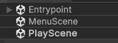

… and drop them in the Scriptable Object

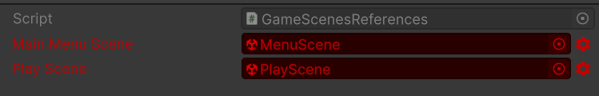

Why is it red ?
Eflatun SceneReference is notifying us that the scenes are not included in the build settings (works with Addressables too).
It can be fixed with a simple click.

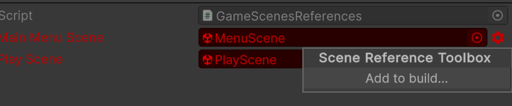

Here is the “EntryPoint” scene.

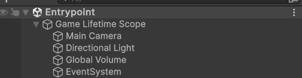


And here is the most basic “MenuScene”.

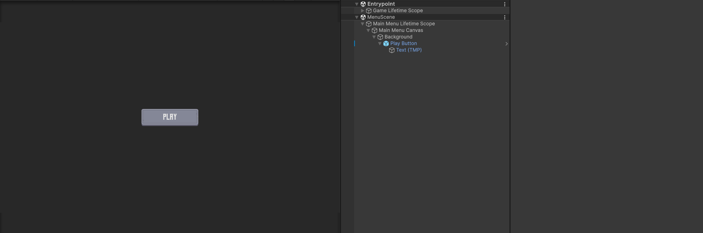

And here is the “PlayScene”.

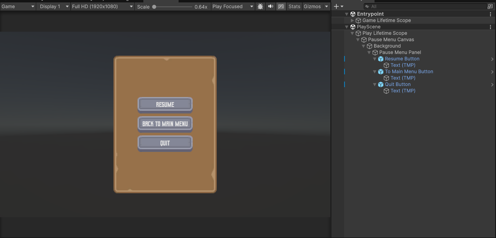

## Adding an animated character Entity

Let’s add an animated character from KayKit Adventurers ([KayKit - Character Pack : Adventurers by Kay Lousberg](https://kaylousberg.itch.io/kaykit-adventurers)) .

There are some steps required to make it animated with Kinemation.

Import Settings and Material  setup : 

- [Latios-Framework-Documentation/Kinemation Animation and Rendering/Getting Started - Part 2](https://github.com/Dreaming381/Latios-Framework-Documentation/blob/main/Kinemation%20Animation%20and%20Rendering/Getting%20Started%20-%20Part%202.md) (I’m going with the Optimized Skeleton route)
- Create a Shader Graph with the Latios Deform node for the Skinned Mesh parts and an URP/Lit for the other parts (non skinned).

And voilà! A flat bone hierarchy, everything appears in the scene and we can see the baked entities (mostly bones).

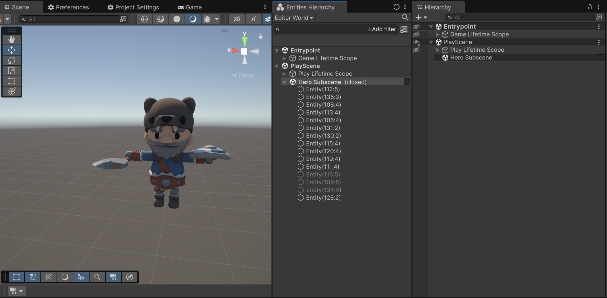

## Actually animating the Character (or… not yet)

Let’s create the required code to play an *idle* animation.

### Components

I will need these components.

```csharp
    /// <summary>
    ///   The idle clip to be played.
    /// </summary>
    public struct IdleClip : IComponentData
    {
        public BlobAssetReference<SkeletonClipSetBlob> ClipSet;
    }

    /// <summary>
    ///    The state of the idle clip.
    /// </summary>
    public struct IdleClipState : IComponentData
    {
        public ClipState State;
    }

    
    /// <summary>
    ///  The state of a clip.
    /// </summary>
    public struct ClipState
    {
		    // Unused in this example
        public float PreviousTime;
        public float Time;
        public float SpeedMultiplier;
        // Unused in this example
        public int EventHash;

        public void Update(float deltaTime)
        {
            PreviousTime =  Time;
            Time         += deltaTime;
        }
    }
```

### Authoring

Next,  I’ll need an Authoring `Monobehaviour` to attach the  `IdleClip`  and the `IdleClipState` components  to the character. Don’t forget to add it to the character… it never happened to me… just saying.

Baking animation clips is done with `SmartBlobbers` in Latios. It can make authoring scripts pretty big and, sometimes, complex but it is a very powerful tool.

```csharp

namespace Survivors.Play.Authoring
{

    [RequireComponent(typeof(Animator))]
    public class IdleAnimationAuthoring : MonoBehaviour
    {
        [SerializeField] AnimationClipProperty idleAnimation;

        [TemporaryBakingType]
        struct AnimationClipSmartBakeItem : ISmartBakeItem<IdleAnimationAuthoring>
        {
            SmartBlobberHandle<SkeletonClipSetBlob> m_handle;

            public bool Bake(IdleAnimationAuthoring authoring, IBaker baker)
            {
                var entity = baker.GetEntity(TransformUsageFlags.Dynamic);
                baker.AddComponent<IdleClip>(entity);

                var clips = new NativeArray<SkeletonClipConfig>(1, Allocator.Temp);
                
                // we are just using one clip
                clips[0] = new SkeletonClipConfig
                {
                    clip     = authoring.idleAnimation.clip,
                    settings = SkeletonClipCompressionSettings.kDefaultSettings
                };

                m_handle = baker.RequestCreateBlobAsset(baker.GetComponent<Animator>(), clips);
                return true;
            }

            public void PostProcessBlobRequests(EntityManager entityManager, Entity entity)
            {
                var clipSet = m_handle.Resolve(entityManager);
                
                // on post process, add the IdleClip component that we will use in an IJobEntity
                entityManager.SetComponentData(entity, new IdleClip { ClipSet = clipSet });
            }
        }

				// Not sure what it does but it is required
        class IdleClipBaker : SmartBaker<IdleAnimationAuthoring, AnimationClipSmartBakeItem>
        {
        }

				// Here goes the *classic* baker
        class IdleAnimationAuthoringBaker : Baker<IdleAnimationAuthoring>
        {
            public override void Bake(IdleAnimationAuthoring authoring)
            {
                var entity = GetEntity(TransformUsageFlags.Dynamic);
                AddComponent(entity, new IdleClipState
                {
                    State = new ClipState
                    {
                        Time            = 0f,
                        PreviousTime    = 0f,
                        SpeedMultiplier = authoring.idleAnimation.speedMultiplier
                    }
                });
            }
        }
    }
	    
    /// <summary>
    ///     Only relevant for the authoring time.
    /// </summary>
    [Serializable]
    public struct AnimationClipProperty
    {
        public AnimationClip clip;
        public float speedMultiplier;
    }
  
}
```

### System

And finally, the `ISystem` that will run the clip.

```csharp
namespace Survivors.Play.Systems.Animations
{
    public partial struct PlayerIdleAnimationSystem : ISystem
    {
        [BurstCompile]
        public void OnUpdate(ref SystemState state)
        {
            state.Dependency = new IdleClipJob
            {
                DeltaTime = SystemAPI.Time.DeltaTime
            }.ScheduleParallel(state.Dependency);
        }

        [BurstCompile]
        partial struct IdleClipJob : IJobEntity
        {
            [ReadOnly] public float DeltaTime;

            void Execute(OptimizedSkeletonAspect skeleton,
                in IdleClip idleClip,
                ref IdleClipState idleClipState)
            {
                ref var clipState = ref idleClipState.State;
                ref var skeletonClip = ref idleClip.ClipSet.Value.clips[0];

                // Update the internal tracked state
                clipState.Update(DeltaTime * clipState.SpeedMultiplier);
                // make sure the time is looped
                clipState.Time = skeletonClip.LoopToClipTime(clipState.Time);

                // Sample the clip and sync the skeleton
                skeletonClip.SamplePose(ref skeleton, clipState.Time, 1f);
                skeleton.EndSamplingAndSync();
            }
        }
    }
}
```

Pretty simple system, right ? 🙂

I press play. Nothing happens. That’s OK because automatic bootstrap is disabled!

## Half a game loop

Sub-goal: 

1. Create a `LatiosBootstrap` class
2. Register the System(s)
3. Make the game boot to the Main Menu Scene.
4. Upon pressing on “Play” load the game scene and bootstrap Latios

Creating a Latios Bootstrap class is super easy, multiple templates are provided. I’m picking the “Standard - Explicit Workflow” and won’t touch it right now (right click : Create → Latios → Bootstrap → Standard - Explicit Workflow).

### ***Top-Down Hierarchical System Ordering* and *Conditional System Updates***

I’ll be using RootSuperSystem(s), SuperSystem(s), etc… 

- It is way less confusing than using `[UpdateBefore]` / `[UpdateAfter]` especially when your system count starts to go up.
- We can override `ShouldUpdateSystems`  and check inside this method if there is any `PauseRequestedTag` enabled.

```csharp
namespace Survivors.Bootstrap.RootSystems
{
    [UpdateInGroup(typeof(SimulationSystemGroup))]
    // Animation-related system are best placed before Latios' TransformSuperSystem
    [UpdateBefore(typeof(TransformSuperSystem))]
    public partial class PreTransformRootSystem : RootSuperSystem
    {
        EntityQuery m_pauseQuery;

        protected override void CreateSystems()
        {
            CreateQueries();
            GetOrCreateAndAddManagedSystem<AnimationSuperSystem>();
        }
        
        void CreateQueries()
        {
            m_pauseQuery = Fluent.WithAnyEnabled<PauseRequestedTag>(true).Build();
        }

        public override bool ShouldUpdateSystem()
        {
            return m_pauseQuery.IsEmptyIgnoreFilter;
        }
    }
}

namespace Survivors.Bootstrap.RootSystems.SuperSystems
{
    public partial class AnimationSuperSystem : SuperSystem
    {
        protected override void CreateSystems()
        {
            GetOrCreateAndAddUnmanagedSystem<PlayerIdleAnimationSystem>();
        }
    }
}
```

I’m not done yet. Let’s code the game’s *Entry Point.*

### Game Router

This Router will live in the top most scope of the game. It handles the two commands requesting scene changes. It already handles the two cases (three ?)

- On main menu requested: unload the Play Scene if loaded, dispose of the ECS world, load the Main Menu Scene
- On play requested: unload the Main Menu Scene if loaded, initialize Latios Bootstrap, load the Play Scene.

```csharp
namespace Survivors.GameScope
{
    public struct MainMenuStateCommand : ICommand
    {
    }

    public struct PlayStateCommand : ICommand
    {
    }

    [Routes]
    public partial class GlobalRouter
    {
        [Inject] GameScenesReferences m_gameScenesReferences;

        async UniTask DisposeScene(SceneReference sceneRef)
        {
            var activeScenes = SceneManager.sceneCount;
            for (var i = 0; i < activeScenes; i++)
            {
                var scene = SceneManager.GetSceneAt(i);
                if (scene.buildIndex == sceneRef.BuildIndex) await SceneManager.UnloadSceneAsync(scene);
            }

            await UniTask.CompletedTask;
        }

        [Route]
        async UniTask On(MainMenuCommand _)
        {
            await DisposeScene(m_gameScenesReferences.playScene);
            
            World.DefaultGameObjectInjectionWorld?.Dispose();
            
            await SceneManager.LoadSceneAsync(m_gameScenesReferences.mainMenuScene.BuildIndex, LoadSceneMode.Additive);
        }

        [Route]
        async UniTask On(PlayStateCommand _)
        {
            await DisposeScene(m_gameScenesReferences.mainMenuScene);

            if (new LatiosBootstrap().Initialize("Latios Survivors World"))
            {
                Debug.Log("Latios initialized");
            }
            else
            {
		            // This should not happen!
                Debug.LogException(new Exception("Latios failed to initialize :'("));
                return;
            }

            await SceneManager.LoadSceneAsync(m_gameScenesReferences.playScene.BuildIndex, LoadSceneMode.Additive);
        }
    }
}
```

### Root Container

Next,  the root container that registers the GameScenesReferences and the GlobalRouter and, finally, publish the MainMenuCommand.

```csharp
namespace Survivors.GameScope
{
    public class GameLifetimeScope : LifetimeScope
    {
        [SerializeField] GameScenesReferences gameScenesReferences;

        protected override void Configure(IContainerBuilder builder)
        {
            builder.RegisterInstance(gameScenesReferences);

            builder.RegisterVitalRouter(routingBuilder => { routingBuilder.Map<GlobalRouter>(); });

            builder.RegisterBuildCallback(container =>
            {
                // Once the container built, we want to start the game in the main menu
                var publisher = container.Resolve<ICommandPublisher>();
                publisher.PublishAsync(new MainMenuCommand());
            });
        }
    }
}
```

Adding it to the Game Lifetime Scope GameObject 

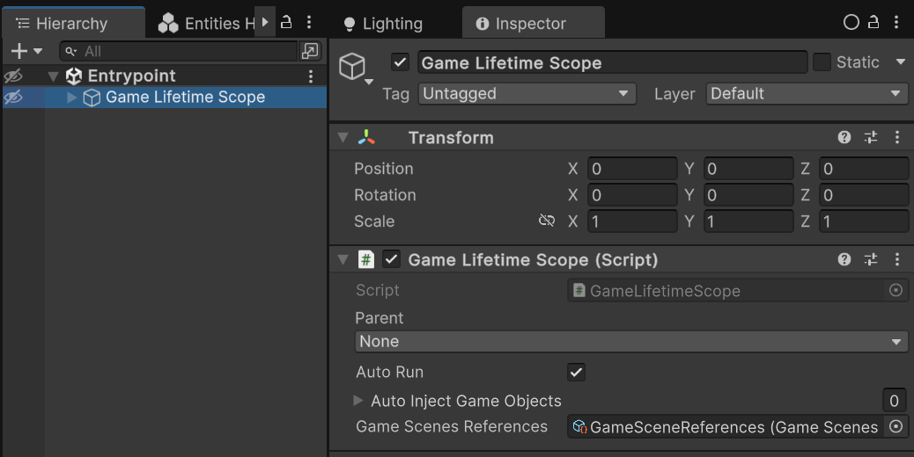

The main menu should load in play mode. Half of half a game loop. It will need some code too.

I’m overengineering it but, in my experience, it pays later when you need to add more buttons, a settings menu, a load game button, etc… 

### Main Menu Router

The main menu router receives the `StartButtonClickedCommand` when… you guessed it. It then uses the parent scope publisher (the *root* scope) to send the `PlayStateCommand`. 

```csharp
namespace Survivors.MainMenu
{
    public struct StartButtonClickedCommand : ICommand
    {
    }

    [Routes]
    public partial class MainMenuRouter : IDisposable
    {
        public ICommandPublisher ParentPublisher;

        [Route]
        void On(StartButtonClickedCommand _)
        {
            ParentPublisher.PublishAsync(new PlayStateCommand()).AsUniTask().Forget();
        }
        
        public void Dispose()
        {
            UnmapRoutes();
        }
    }
}
```

### Main Menu Entry Point

We’ll define a KISS `MainMenuEntryPoint` that will listen for a button click and react by publishing the  `StartButtonClickedCommand`.

```csharp
namespace Survivors.MainMenu
{
    [AddComponentMenu("Survivors/Main Menu/Main Menu Behavior")]
    public class MainMenuBehavior : MonoBehaviour
    {
        [SerializeField] Button startButton;
        public Button StartButton => startButton;
    }
}

namespace Survivors.MainMenu
{
    public class MainMenuEntryPoint : IStartable, IDisposable
    {
        [Inject] ICommandPublisher m_commandPublisher;
        [Inject] MainMenuBehavior m_menuBehavior;

        public void Dispose()
        {
            m_menuBehavior.StartButton.onClick.RemoveListener(OnStartClicked);
        }

        public void Start()
        {
            m_menuBehavior.StartButton.onClick.AddListener(OnStartClicked);
        }

        void OnStartClicked()
        {
            m_commandPublisher.PublishAsync(new StartButtonClickedCommand())
                .AsUniTask().Forget();
        }
    }
}
```

### Child Scope

FINALLY, the main menu will have its own lifetime scope and an isolated router.

```csharp
namespace Survivors.MainMenu
{
    public class MainMenuLifetimeScope : LifetimeScope
    {
        [SerializeField] MainMenuBehavior m_menuBehavior;

        protected override void Configure(IContainerBuilder builder)
        {
            builder.RegisterInstance(m_menuBehavior);

            builder.UseEntryPoints(cfg =>
            {
                cfg.Add<MainMenuEntryPoint>();
                cfg.OnException(Debug.LogException);
            });

            builder.RegisterVitalRouter(routing =>
            {
                routing.Isolated = true;
                routing.Map<MainMenuRouter>();
            });

            builder.RegisterBuildCallback(container =>
            {
                var publisher = Parent.Container.Resolve<ICommandPublisher>();
                var mainMenuRouter = container.Resolve<MainMenuRouter>();
                mainMenuRouter.ParentPublisher = publisher;
            });
        }
    }
}
```

Who forgot to add this script on the main menu root GameObject… and to set its parent scope as `GameLifetimeScope` ? Not me 🙄

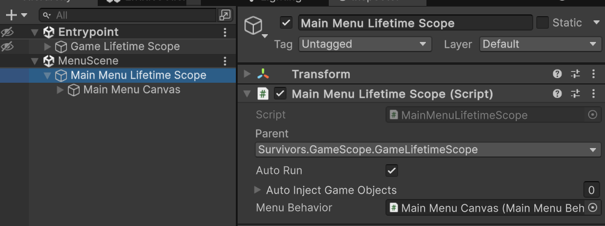

Now, we can press play.

<Video src={frontmatter.baseVideoUrl +'animated_warriors.mp4'} />
*I may have added one or two of them.*

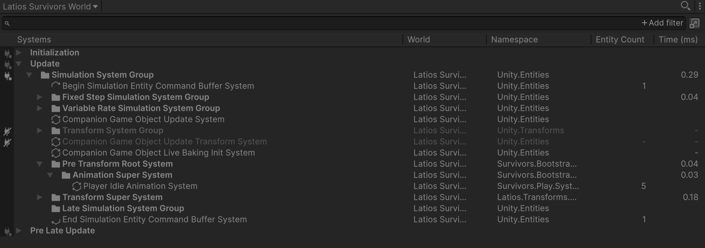

*Beautiful!*

### Play Mode

And now, if I exit play mode, “Latios Survivors World” is still active. Which is not what I want.
Here is a handy snippet that I put inside `GameLifetimeScope` 

```csharp
#if UNITY_EDITOR
    protected override void Awake()
    {
        base.Awake();
	
        // Dispose MANUALLY the world when exiting play mode
        EditorApplication.playModeStateChanged += state =>
        {
            if (state == PlayModeStateChange.ExitingPlayMode)
            {
                World.DefaultGameObjectInjectionWorld?.Dispose();
            }
        };
    }
#endif
```

## The other half

Now that I’m *in-game* I should be able to go back to the main menu.

### In Game Menu

I’ll add a simple MonoBehaviour to the in-game menu. It exposes the three buttons and two methods to hide and show this menu.

```csharp
namespace Survivors.Play.Scope.MonoBehaviours
{
    [RequireComponent(typeof(CanvasGroup))]
    public class PlayStateMenu : MonoBehaviour
    {
        [SerializeField] Button resumeButton;
        [SerializeField] Button mainMenuButton;
        [SerializeField] Button quitButton;

        public Button ResumeButton => resumeButton;
        public Button MainMenuButton => mainMenuButton;
        public Button QuitButton => quitButton;

        CanvasGroup m_canvasGroup;

        void Awake()
        {
            m_canvasGroup = GetComponent<CanvasGroup>();
        }

        public void Show()
        {
            m_canvasGroup.alpha          = 1;
            m_canvasGroup.blocksRaycasts = true;
            m_canvasGroup.interactable   = true;
        }

        public void Hide()
        {
            m_canvasGroup.alpha          = 0;
            m_canvasGroup.blocksRaycasts = false;
            m_canvasGroup.interactable   = false;
        }
    }
}
```

### At Your Commands!

I’m moving the two commands that are in the GlobalRouter in a GameStatesCommands file and add two more to handle.

```csharp
namespace Survivors.GameScope.Commands
{
    public struct MainMenuStateCommand : ICommand { }
    public struct PlayStateCommand : ICommand { }
    public struct RequestPauseStateCommand : ICommand { }
    public struct RequestResumeStateCommand : ICommand { }
}
```

Then, I’m adding MORE commands to handle the play state menu behavior!

```csharp
namespace Survivors.Play.Scope
{
    public struct ResumeButtonClicked : ICommand { }
    public struct BackToMainMenuClicked : ICommand { }
    public struct ExitGameClicked : ICommand { }
}
```

### MV-MVC-VC-VCCS-MVVM-WTF

Yes, I’ll need a *Controller*  (introducing R3) and, yes, I’m the guy who despised the Senior Software Architect… 😐

The *Controller* subscribes to clicks on the in-game menu’s buttons and sends the command to the `PlayStateRouter`. It subscribes to the pause and resume requests sent by the, soon to come, input reader and shows or hide the menu.

```csharp
namespace Survivors.Play.Scope
{
    public class PlayStateController : IStartable, IDisposable
    {
        [Inject] PlayStateMenu m_playStateMenu;
        [Inject] ICommandSubscribable m_commandSubscribable;
        [Inject] ICommandPublisher m_commandPublisher;

        DisposableBag m_disposable;

        public void Start()
        {
            m_disposable = new DisposableBag();

            m_playStateMenu.ResumeButton.OnClickAsObservable().Subscribe(OnResumeClicked)
                .AddTo(ref m_disposable);
            m_playStateMenu.MainMenuButton.OnClickAsObservable().Subscribe(OnMainMenuClicked)
                .AddTo(ref m_disposable);
            m_playStateMenu.QuitButton.OnClickAsObservable().Subscribe(OnQuitClicked)
                .AddTo(ref m_disposable);

            m_commandSubscribable.Subscribe<RequestPauseStateCommand>(OnPauseStateRequested)
                .AddTo(ref m_disposable);
            m_commandSubscribable.Subscribe<RequestResumeStateCommand>(OnResumeStateRequested)
                .AddTo(ref m_disposable);

            m_playStateMenu.Hide();
        }

        public void Dispose()
        {
            m_disposable.Dispose();
        }

        void OnPauseStateRequested(RequestPauseStateCommand _, PublishContext ctx)
        {
            m_playStateMenu.Show();
        }

        void OnResumeStateRequested(RequestResumeStateCommand _, PublishContext ctx)
        {
            m_playStateMenu.Hide();
        }

        void OnResumeClicked(Unit _)
        {
            m_commandPublisher.PublishAsync(new ResumeButtonClicked());
        }

        void OnMainMenuClicked(Unit _)
        {
            m_commandPublisher.PublishAsync(new BackToMainMenuClicked());
        }

        void OnQuitClicked(Unit _)
        {
            m_commandPublisher.PublishAsync(new ExitGameClicked());
        }
    }
}
```

### On The *Route* Again

These commands are not sent into the void. I’m creating my usual scope router that pairs with the controller. It sends the RequestResumeStateCommand when clicking on the Resume button and uses the parent publisher when the Back To Main Menu button is pressed to let know to the outer scope that we want to leave. 

```csharp
namespace Survivors.Play.Scope
{
    [Routes]
    public partial class PlayStateRouter
    {
        [Inject] ICommandPublisher commandPublisher;

        public ICommandPublisher ParentPublisher { get; set; }

        [Route]
        async UniTask On(ResumeButtonClicked _)
        {
            await commandPublisher.PublishAsync(new RequestResumeStateCommand());
        }

        [Route]
        async UniTask On(BackToMainMenuClicked _)
        {
            await ParentPublisher.PublishAsync(new MainMenuStateCommand());
        }

        [Route]
        void On(ExitGameClicked _)
        {
#if UNITY_EDITOR
            // pretty handy when you want to stop the game in the editor
            EditorApplication.ExitPlaymode();
#else
			Application.Quit(0)	;
#endif
        }
    }
}
```

### Listening to the player’s input

I will need to listen for the *Escape* key to trigger the pause.
Let’s use the default Input Actions asset et generate a C# class from the inspector, create a new System and register it on the Latios’ Side.

Here comes an example of injection into a system and some use of R3’s `ReactiveProperty<T>` and Observable.

There is some *back and forth*  here.
When the escape key is pressed, a command is published to the router… and to itself, reacting to it by adding or removing the `PauseRequestTag`to the scene’s blackboard entity.

```csharp
namespace Survivors.Play.Systems.Input
{
    public partial class EscapeKeySystem : SubSystem
    {
        ICommandPublisher m_commandPublisher;
        ICommandSubscribable m_commandSubscriber;
        readonly ReactiveProperty<bool> m_isEscapePressed = new();
        DisposableBag m_disposableBag;
        InputSystem_Actions m_inputSystemActions;

        [Inject]
        public void Construct(ICommandPublisher commandPublisher, ICommandSubscribable commandSubscriber)
        {
            m_commandPublisher  = commandPublisher;
            m_commandSubscriber = commandSubscriber;

            m_commandSubscriber.Subscribe<RequestPauseStateCommand>((command, ctx) =>
            {
                sceneBlackboardEntity.AddComponent<PauseRequestedTag>();
            }).AddTo(ref m_disposableBag);

            m_commandSubscriber.Subscribe<RequestResumeStateCommand>((command, context) =>
            {
                sceneBlackboardEntity.RemoveComponent<PauseRequestedTag>();
            }).AddTo(ref m_disposableBag);

            m_isEscapePressed.Subscribe(OnEscapePressed)
                .AddTo(ref m_disposableBag);
        }

        void OnEscapePressed(bool isEscapePressed)
        {
            if (!isEscapePressed) return;

            if (sceneBlackboardEntity.HasComponent<PauseRequestedTag>())
                m_commandPublisher.PublishAsync(new RequestResumeStateCommand());
            else
                m_commandPublisher.PublishAsync(new RequestPauseStateCommand());
        }

        protected override void OnCreate()
        {
            m_inputSystemActions = new InputSystem_Actions();
            m_inputSystemActions.Enable();
        }

        protected override void OnUpdate()
        {
            m_isEscapePressed.Value = m_inputSystemActions.UI.Escape.ReadValue<float>() > .1f;
        }

        protected override void OnDestroy()
        {
            m_disposableBag.Dispose();
            m_inputSystemActions.Disable();
        }
    }
}
```

### Last Injection

Finally, here is the Play Lifetime Scope as a child of GameLifetimeScope

```csharp
namespace Survivors.Play.Scope
{
    public class PlayLifetimeScope : LifetimeScope
    {
        [SerializeField] PlayStateMenu playStateMenu;

        protected override void Configure(IContainerBuilder builder)
        {
            builder.RegisterInstance(playStateMenu);

            builder.UseEntryPoints(cfg =>
            {
                cfg.Add<PlayStateController>();
                cfg.OnException(Debug.LogException);
            });

            builder.RegisterVitalRouter(routing =>
            {
                routing.Isolated = true;
                routing.Map<PlayStateRouter>();
            });

            builder.RegisterSystemFromDefaultWorld<EscapeKeySystem>();

            builder.RegisterBuildCallback(container =>
            {
                var publisher = Parent.Container.Resolve<ICommandPublisher>();
                var playStateRouter = container.Resolve<PlayStateRouter>();
                playStateRouter.ParentPublisher = publisher;
            });
        }
    }
}
```

## Two Half of a Loop

Voilà! Proof of concept: done!

<Video src={frontmatter.baseVideoUrl + 'two_half_a_loop.mp4'} />

# Conclusion

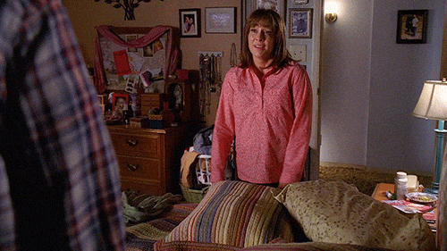

What a wall of text and code, eh? I’ll be writing a *Making a Survivors-like with Latios Framework Part 2*  and it will be, I hope, a bit shorter and more focused on one aspect of Latios at a time.

Meanwhile, I’m hosting the above code here : https://github.com/clandais/Latios-Survivors-Articles/tree/Part1