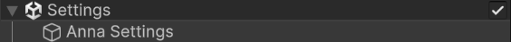
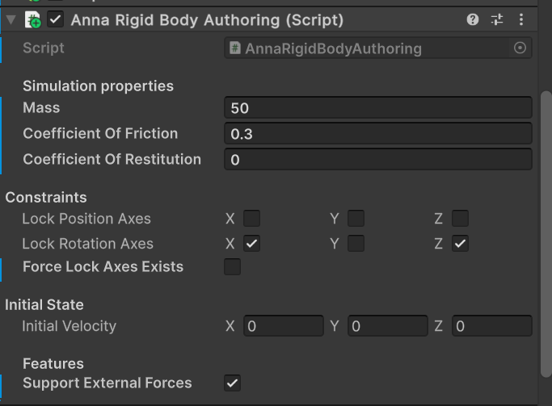

import { Picture } from 'astro:assets';
import Caption from '../../../components/Caption.astro';
import annaMetro from './img/anna-metro.jpg';

# Making the Character Move

## Psyshock

Psyshock is one of Latios' modules. As described in the documentation:
> Psyshock Physics is a physics and spatial query module focused on user control. While most physics engines provide out-of-the-box simulation, Psyshock instead provides direct access to the underlying algorithms so that you can craft the perfect physics simulation for your game and not waste any computation on things you don’t need. Psyshock’s Collision Layers can be built directly from Entity Queries, removing all the archetype guesswork out of collisions and triggers.

## Anna

<Picture src={annaMetro} formats={['avif', 'webp']}  height={450} alt="One Anna" />
<Caption >Not This Anna</Caption>

